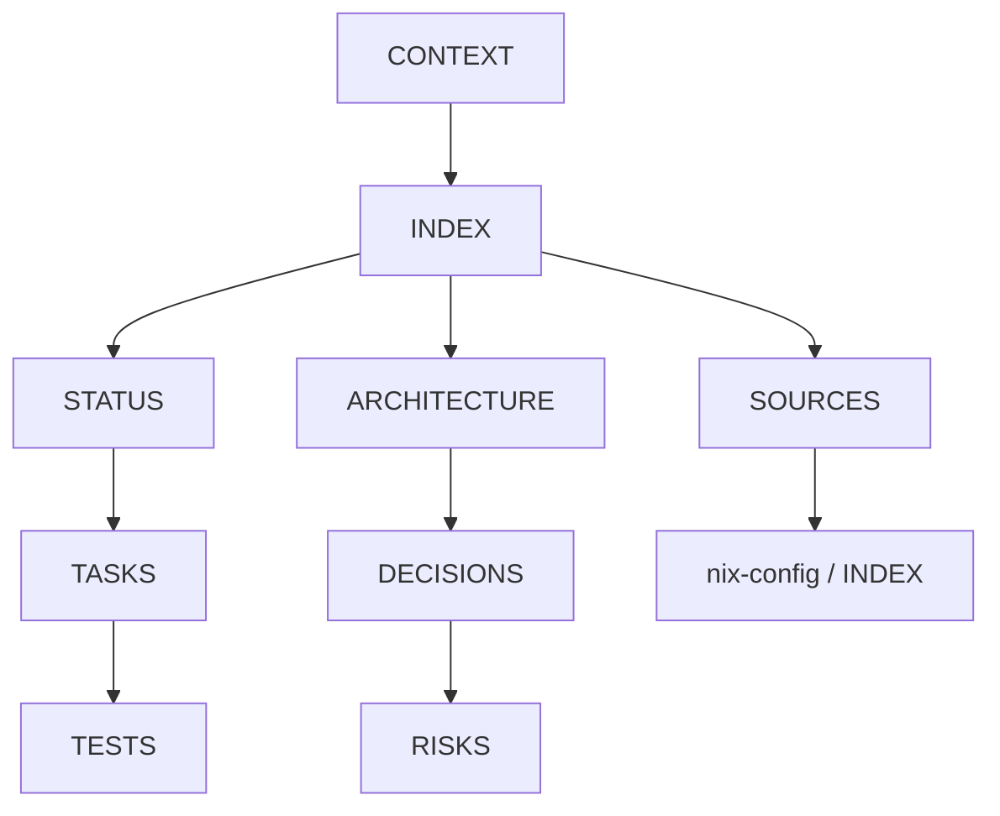

# Context graph

```mermaid
flowchart TD
    Route["CONTEXT"] --> Index["INDEX"]
    Index --> Status["STATUS"]
    Index --> Architecture["ARCHITECTURE"]
    Index --> Sources["SOURCES"]
    Architecture --> Decisions["DECISIONS"]
    Status --> Tasks["TASKS"]
    Tasks --> Tests["TESTS"]
    Decisions --> Risks["RISKS"]
    Sources --> Config["nix-config / INDEX"]
```

Machine-readable edges are in graph.yaml. Read the route and index first,
then only the nodes relevant to the task. The cross-project config edge is explicit.
